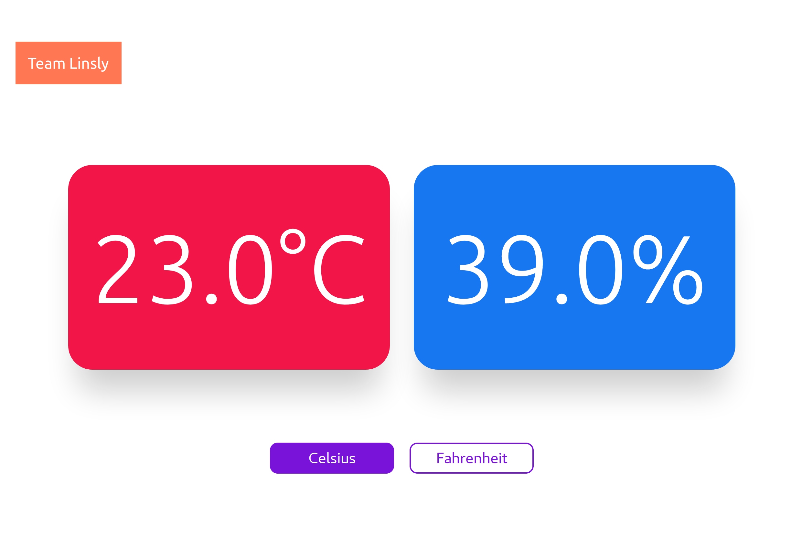
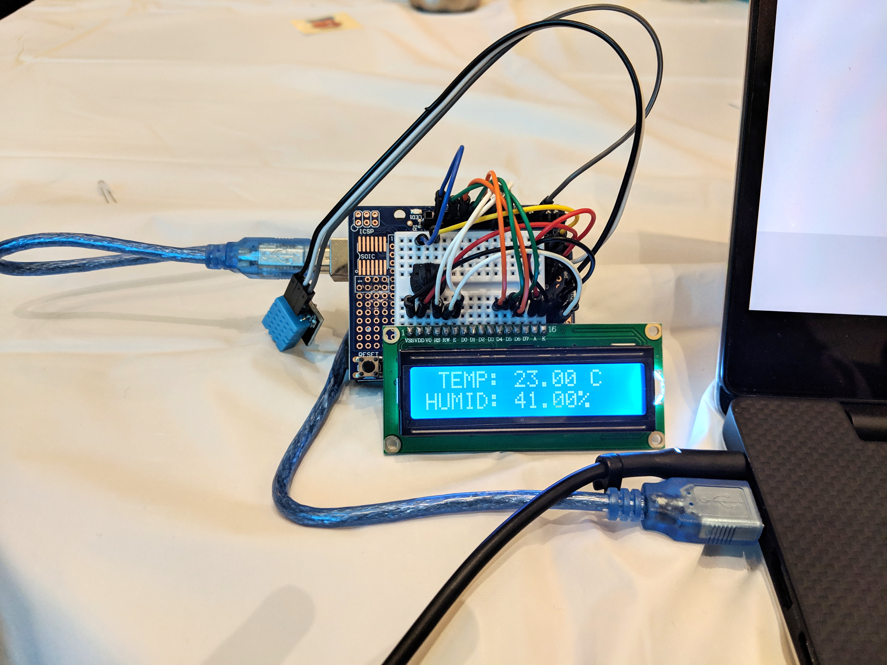
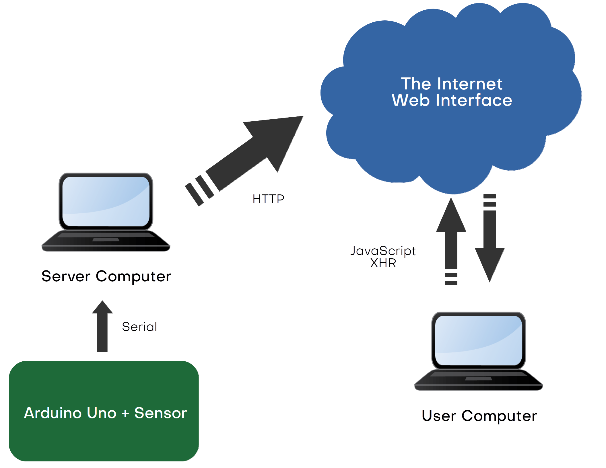

# Temperature & Humidity Report Device (Thermostat)

### Feeling cold? Or perhaps want to monitor temperature and humidity of a greenhouse / lab environment? Our solution powers you from the smallest of comfort to the most professional of settings.

An Arduino device senses room temperature & humidity, sends data back to the computer, which in turn parses the data and serves them to a web interface.
The user has the choice between `Fahrenheit` AND `Celsius` temperature.   

   
   
## Project Structure

`TempHumidClient`: Static Web Interface (Needs to be served by an HTTP server)   
`TempHumidServerCode`: Backend that handles serial communication and responds to GET requests from client browser.   

Server can easily by set up on a Raspberry Pi, then the cost and portability/footprint will be dramatically decreased. Currently, though, the Arduino is configured to run with the laptop.
